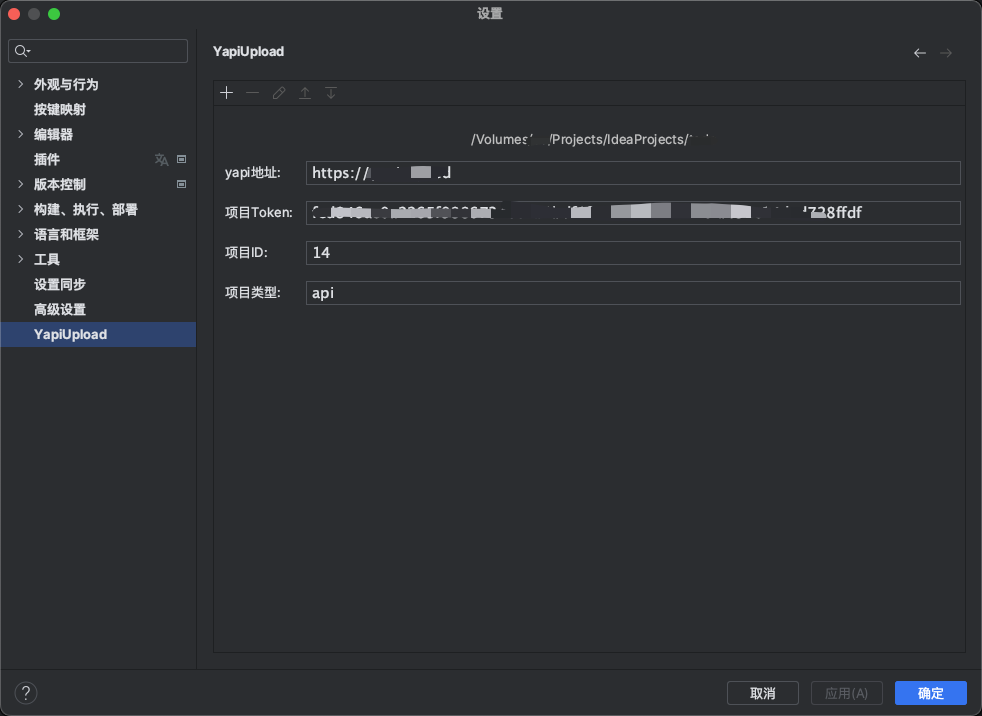
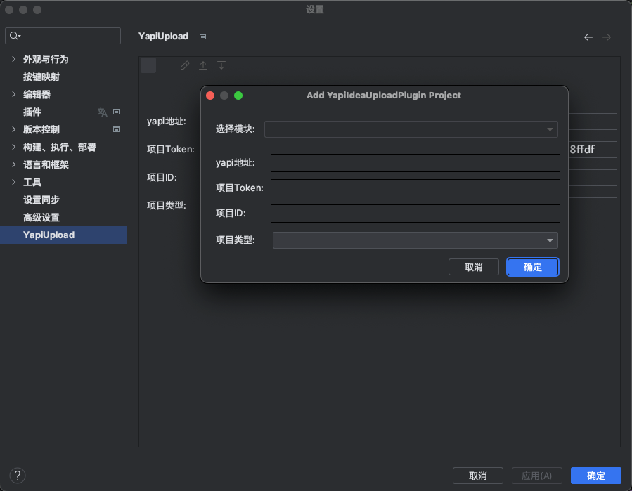

# YapiUploadPro
https://github.com/xujiaji/YapiIdeaUploadPlugin

En: Upload the interface of the spring boot project to the yapi server through the plug-in.

Zh: 将SpringBoot项目的接口通过该插件上传到yapi服务器

#### Purpose（目的）
En: Reduce yapi entry time, reverse standardize code comments through tools, and code cleanliness.

Zh: 减少yapi 录入时间，通过工具反向规范代码注释，和代码整洁

#### How to use（使用方式）
En: 1. Find "YapiUpload" in idea settings and configure ypai.

Zh: 1、在idea设置中找到“YapiUpload”配置ypai

En: 2. Add configuration (note: the module is an absolute path, and the path is used to determine which project to upload to yapi).

Zn: 2、添加配置（注意：模块是绝对路径，通过路径判断上传到yapi哪个项目）

En: 3. Right-click the controller interface file, and after the pop-up menu, click '点击UploadToYapi'.

Zn: 3、右键controller接口文件，弹窗菜单后，点击UploadToYapi

> En: Some comment configuration

|Show Effects|Tags|Location|
|--|--|--|
|Main Category|@menu:|Add on Category|
|Subcategory|@menu:|Add on method|
|Interface Status Mark|@status under development (or undone) &emsp;&emsp;&emsp;&emsp;released(done) &emsp;&emsp;&emsp;&emsp;design(design)<br/ >&emsp;&emsp;&emsp;&emsp;testing &emsp;&emsp;&emsp;&emsp;deprecated &emsp;&emsp;&emsp;&emsp;stopping< br/>&emsp;&emsp;&emsp;&emsp; (Note: do not write the default development)|Add on the method|
|Specify the interface path |@path| add on the method|

Other see: https://github.com/diwand/YapiIdeaUploadPlugin/wiki/%E5%BF%AB%E9%80%9F%E4%BD%BF%E7%94%A8

> Zn: 一些注释配置

|显示效果|标记|位置|
|--|--|--|
|主分类|@menu:|类上添加|
|子分类|@menu:|方法上添加|
|接口状态标记|@status 开发中 (或者 undone) &emsp;&emsp;&emsp;&emsp;已发布(done) &emsp;&emsp;&emsp;&emsp;设计中(design) &emsp;&emsp;&emsp;&emsp;已提测(testing) &emsp;&emsp;&emsp;&emsp;已过时(deprecated) &emsp;&emsp;&emsp;&emsp;暂停开发(stoping) &emsp;&emsp;&emsp;&emsp;（注：不写默认开发中）|方法上添加|
|指定接口路径|@path|方法上添加|

其它见：https://github.com/diwand/YapiIdeaUploadPlugin/wiki/%E5%BF%AB%E9%80%9F%E4%BD%BF%E7%94%A8

#### About （关于）
En: Refactored from：https://github.com/diwand/YapiIdeaUploadPlugin

Zn: 重构自：https://github.com/diwand/YapiIdeaUploadPlugin
